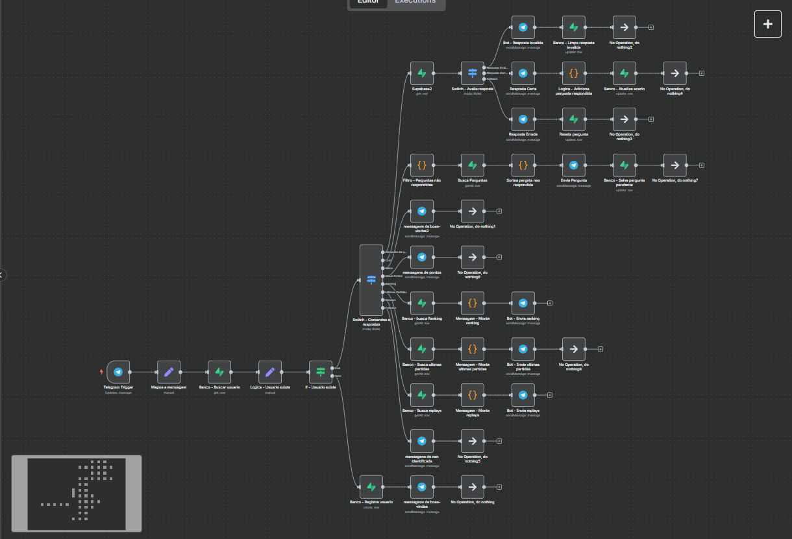

# 🤖 PantherBot – Chatbot da FURIA

Este é o PantherBot, um chatbot interativo feito com **n8n**, voltado para os fãs da FURIA.

🎯 **Projeto desenvolvido especialmente para o processo seletivo de Assistente de Engenharia de Software da FURIA.**

🔗 **Acesse o bot no Telegram**: [t.me/Panther_furiaBot](https://t.me/Panther_furiaBot)

---

## 🧠 Funcionalidades

- 🎯 Sistema de Quiz com perguntas aleatórias e sistema de pontos
- 🏆 Ranking TOP 5 FURIOSOS
- 🎮 Últimas partidas da FURIA com resultados
- 🔁 Replays das partidas com link direto para assistir
- 🧠 Evita perguntas já respondidas por cada usuário
- 📊 Armazena o progresso, pontuação e respostas dos usuários

---

## ⚙️ Tecnologias Utilizadas

- n8n – Plataforma de automações (versão self-hosted)
- Supabase – Banco de dados e autenticação
- Telegram Bot API – Interação com o usuário
- Docker + Docker Compose – Para rodar localmente
- Coolify – Painel para deploy e gestão do bot em ambiente de produção
- Cloud VPS + domínio customizado – Bot rodando 24/7
- Ngrok – Usado localmente para expor o n8n via HTTPS e conectar ao Telegram

---

## 🧩 Estrutura do Banco de Dados

### users
- id
- id_telegram
- username
- points
- questions_answered (json)
- answering_question

### questions
- id
- question
- option_1
- option_2
- option_3
- correct_option

### matches
- id
- title
- date
- scoreboard
- replay_url

---

## 🚀 Como Rodar Localmente

1. Clone o repositório:
```bash
git clone https://github.com/kaduh15/pantherbot-furia.git
cd pantherbot-furia
```

2. Configure o `.env` ou variáveis diretamente no painel n8n.

3. Inicie com Docker:
```bash
docker-compose up -d
```

4. Acesse: [http://localhost:5678](http://localhost:5678)

---

## 🌐 Expor o n8n com HTTPS (para o Telegram)

O Telegram exige um endpoint HTTPS público.

Use o `ngrok`:

```bash
ngrok http 5678
```

Copie o link `https://xxxxx.ngrok.io` e registre como webhook:

```bash
curl -X POST https://api.telegram.org/botSEU_TOKEN/setWebhook \
  -d url=https://xxxxx.ngrok.io/webhook
```

---

## 🧠 Aprendizados Pessoais

Durante o desenvolvimento do PantherBot, aprendi e pratiquei:

- Fluxos complexos no **n8n** com lógica, expressões e integração com Supabase e Telegram
- Automação com **Docker** e `docker-compose`
- Deploy self-hosted em servidor VPS
- Uso de **Coolify** como painel para deploy
- Configuração de domínio e HTTPS
- Exposição local via **Ngrok** para testar webhooks do Telegram

---

## 🖼️ Recursos Visuais



---

## 👨‍💻 Autor

Desenvolvido por Carlos Eduardo (Kadu)

- [linkedin.com/in/kaduh15](https://linkedin.com/in/kaduh15)
- [github.com/kaduh15](https://github.com/kaduh15)
- kadu.silva2014@gmail.com
